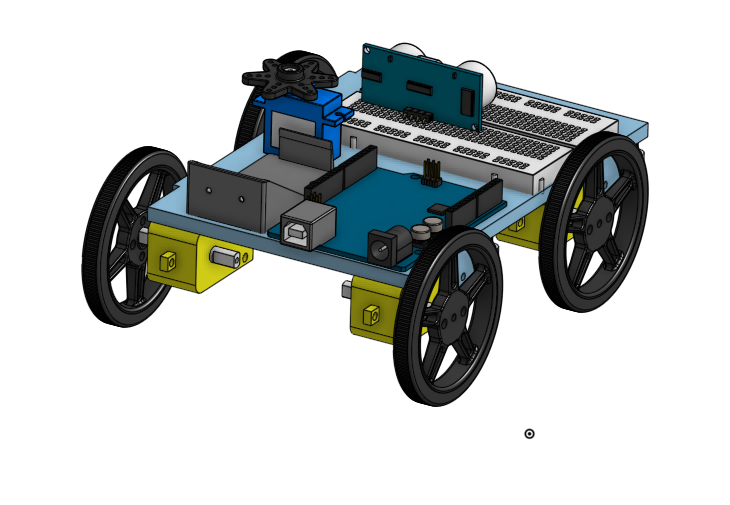
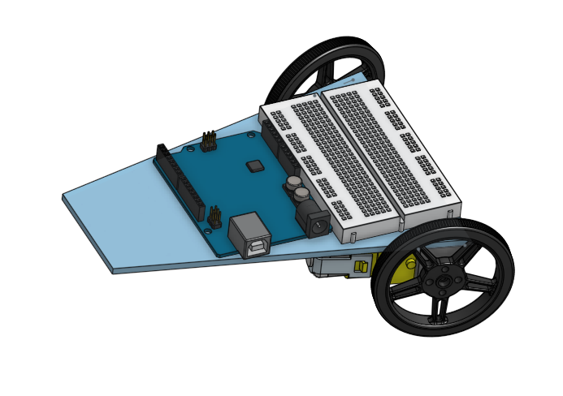

# The-line-follower-robot
### The problem that we are trying to slove. 
We want the line following robot to follow a 10 foot electrical tape line and blink at the end in 30 seconds or less, or We can time the robot to see if it solves and moves fast enough.

### What should it look like:
It would either look like a plane or car. We can make it whatever shape and look how we want when it comes time to build. 
To make the robot stop we would have it programmed where if both sensors see black then it will stop. Put electrical tape perpendicular to the end of the trail.

### What components will it use?
Arduino, light sensors, breadboard, wheels, servo. 

### How does this solution solve the problem?
We want the line following robot to follow a 10 foot electrical tape line and blink at the end in 30 seconds or less. 

### Images

These pictures are the series showing how our prototype design evolved and was built. The first image is when we started,and the design was refined and evolved over time. 

                              
 

                                                  
                                                                       

### Description for code

The IR sensors will go on top of the platform facing the front, we will have a rectanguar hole and a small circle hole to use to mount the sensors to the platform.  
I haven't yet figured out how the bearings are mounted, but once I do there will be 2 bearings, one under each corner of the flat short top of the platform. They will be by the corners of it so there is space in the middle. 
The Red LED means the sensor is on. The Green LED means the sensor is off the red LED is on.  
I am done with testing the sensor but I am not fully done with the LED coding and wiring I am trying to make the 2 LED blink when the sensor see the line. In the picture as you see when the sensor is on, the LED is off so I need to make the LED and sensor turn on at the same time. 

I finished working on one sensor I made the LEDs blink with the sensor when is the sensor is one and when the sensor is off the Blue LED is turning on. 
I am not fully done working on two sensors but I get to make the LEDs blink when the sensors are on and off. The LED are working the opposite they are turning on when is the sensors are off and when the sensors are on the LEDs turn off so I will working on that when I am in person, this was so hard and annoying so I just leave it, so today I start working on motors. Mr. H he find me the code for the motors and he helped me do the wiring so first I will be working on tinkercad than start doing it in real life because I thought it was be easier. This is the wiring that Mr. H made for the motor code.

### Timing and questions
We feel that we are on schedule for timing, and are moving forward at a good pace.
Mariam learned how to make the sensor and leds connect and work together. 
Ellen made the new base, we changed the shape, and worked with the angled edges to fit things in and mate. 
What major obstacle is keeping you from making better progress on your project?" I don't think there is something that would keeping us from making better progress on your project. I think Ellen don't have any trouble doing her work I think she is doing great, For me I am really having trouble doing the codes thanks to Mr H he always help me I am trying to join the office hours more and get the work faster. 
The project is going well we are both good. we are in time, there is nothing that keeps us from make better progress. Ellen is staying virual but the first thing she would do is "I'm going to make sure the platform is ready to be lazer cut", the first thing I would do is start writing the finally code for line flower robot. 
We want to have a good basis for the code for when we are back in person. The base should be ready for laser cutting when Mariam is in person, so that we can start assembling in person.

### Evidence
[The line follower robot](https://cvilleschools.onshape.com/documents/743c3a3f282ab210d2796bd6/w/02d70816b3359241ee76c548/e/c5aadb6f23f4130883132ef9)

[The Psuedo code in Arduino creator](https://create.arduino.cc/editor/msadat50/e3b6a5ae-a4c5-4c0b-ab53-76ac26d9ec94)

[The  pre-planning document](https://docs.google.com/document/d/1idRfQCpvHKo8GRGbCQ3pOBpJywhvD05gfXNWaKVmz3g/edit)

[The finally psuedo code in Arduino creator](https://create.arduino.cc/editor/msadat50/dbc4a521-55cb-4731-a6ce-0e8daa217f65/preview)

[The sensor and LED code in Arduino creator](https://create.arduino.cc/editor/msadat50/ef683b88-eb43-4e9e-9c10-781c19d8be84)

[The one sensor test code in Arduino creator](https://create.arduino.cc/editor/msadat50/ef683b88-eb43-4e9e-9c10-781c19d8be84)

[The two sensor test code in Arduino creator](https://create.arduino.cc/editor/msadat50/4eeaabe9-3179-4b3c-8f25-4de919b0e099)

### Resources that helped me in code and wiring

[Helpful resources](https://circuitdigest.com/microcontroller-projects/line-follower-robot-using-arduino)

[Helpful resources ](https://create.arduino.cc/projecthub/saher-iqbal/line-follower-robot-36516b)

[Helpful resources ](https://create.arduino.cc/projecthub/robocircuits/line-follower-robot-arduino-299bae)

[Helpful resources](https://learn.adafruit.com/adafruit-drv8833-dc-stepper-motor-driver-breakout-board)

### Description 
Our goal for this project is that we want to get this project done fast. And we want it to work really well, We also can't wait to see it working. 
We are almost done with the project I attacked the motors we just need to do the wheels and we need to fix the platform so the motors holes go through the platform holes.
We want our Robot to complete our maze of 10 feet in 30 seconds or less. When it completes the maze, we may have leds flash to celebrate. 
