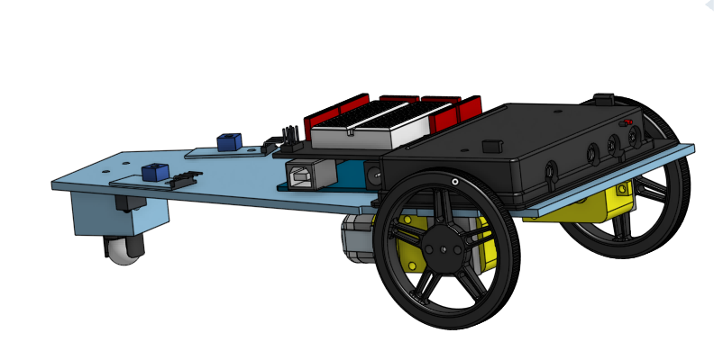
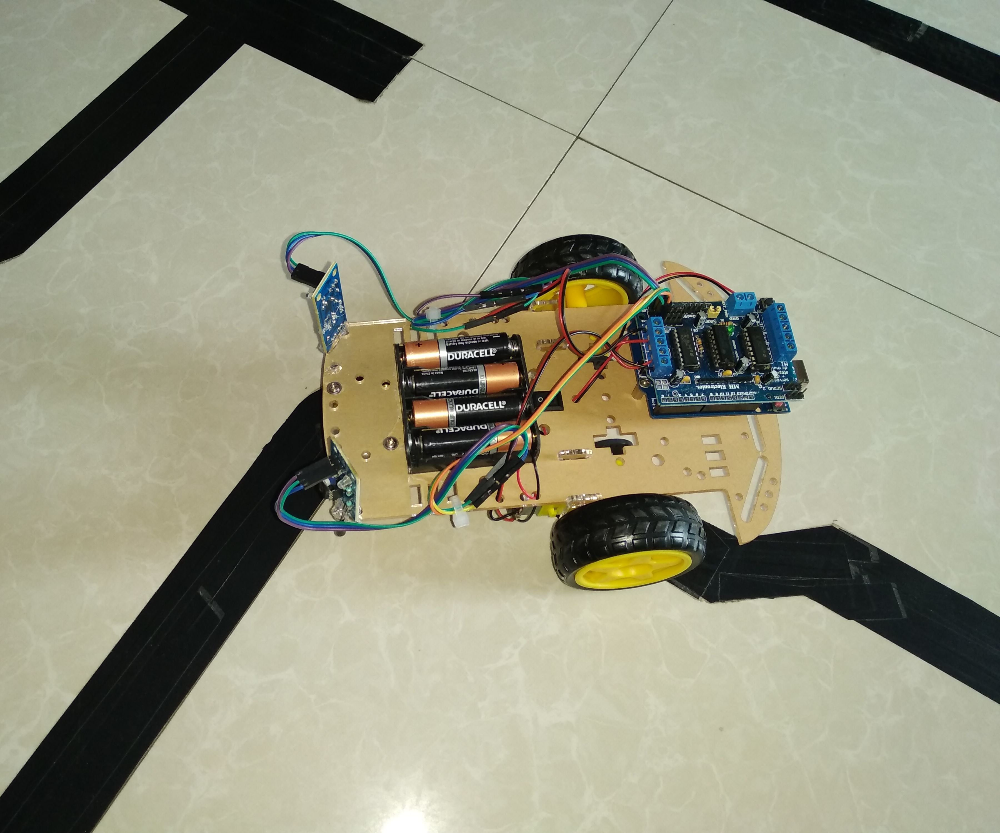

# The-line-follower-robot
This is the link follower robot where it's following the line. A line follower robot is a robot that can detect and follow a line draw in floor. The path can be either visible like a black line in a white sureface. We created this because we want to do something different something that we have never done.
made by Mariam Sadat and Ellen Lynch
## Table of Contents
* [Table of Contents](#TableOfContents)
* [Project prep questions](#Project_prep_questions)
* [Pictures of our progress](#Progress_pictures)
* [Coding progress check in](#Coding_progress)
* [Timeline check](#Time_checkin)
* [Proof](#Proof_of_our_work)
* [Coding Resources](#Coding_resources)
* [Final Reflections](#Final_Reflections)
---
## The final project picture 

This is the final look of the line following robot. we used a caster wheel because when the robot is moving it's easy for the wheel to move in any direction. And Ellen made that small squar to keep the base balance. 

## Project_prep_questions

### The problem that we are trying to solve. 
We want the line following robot to follow a 10 foot electrical tape line and blink at the end in 30 seconds or less, or We can time the robot to see if it solves and moves fast enough.

### What it might look like:
It would either look like a plane or car. We can make it whatever shape and look how we want when it comes time to build. 
To make the robot stop we would have it programmed where if both sensors see black then it will stop. Put electrical tape perpendicular to the end of the trail.

### The Components:
* Arduino Uno
* DF Robot prototyping shield
* light sensors
* breadboard
* Servo attached wheels
* Continuous motion servos (2)
* Adafruit DRV833 Motor Driver Module
* TCRT5000 Infrared Signal Reflective Track Sensor
* 6AA battery pack

### How does this solution solve the problem?
We want the line following robot to follow a 10 foot electrical tape line and blink at the end in 30 seconds or less. 

## Progress_pictures

### Images

These pictures are the series showing how our prototype design evolved and was built. The first image is when we started,and the design was refined and evolved over time. 

This is our protoype shape we are not sure what shape we want to do but this squar is good for now, and those are all the things that we are going to use.

This is the line follower robot picture we want to show that our robot will look kind of like this and it will follow the line like this robot. 
                              
 
Mr. H draw this for me this  meant to help me understand more of how the line follower robot works. So when the both sensors are high the robot will move forward,  when the right sensor is on and the left sensor is off it's turning left, When the right sensor off and the left sensor is on it's turning right. Lastly when both are low they will stop at the end of the line and we will also have a line that looks like a T-shape at the end of the line so when the robot got to the T-shape it will stop. 

This picture is when we start doing the prototype we creat a base and put everything on the top of the base.

We are almost done with base we just need to attache thr wheels to the motors and we are done. 

This the final prototype picture we attached everything on the base. 
                                   
This is when I was using 2 LEDs to make the sensors work. when it's seeing a white surface the Blue LED is turning one and when the sensor is off the red LED is turning on. 
 
This is the writing circuit for one sensor as you see I am using a switch because in Tinkercad there wasn't an sensor like the one that I had so I am using the switch as the sensor.                        

This is the wiring for the 2 sensors I had so much trouble doing this and sometimes the LEDS where opposite but I finall got it done with so much help.

This is the wiring circuit for 2 sensor I used the switches as the sensor. 

This is the Adafruit wiring the Ain1 is motor A which is the left motor the Bin1 is motor B which is the  right motor. 5V is the power, the ACUT motor A is where the arduino pins goes like pin 13 same thing for the BOUT which is motor B.

This is the circuit for the sensor it shows how the sensor is working. 

This is the measurement for different parts.

## Coding_progress

### Description for code

The IR sensors will go on top of the platform facing the front, we will have a rectanguar hole and a small circle hole to use to mount the sensors to the platform.  
I haven't yet figured out how the bearings are mounted, but once I do there will be 2 bearings, one under each corner of the flat short top of the platform. They will be by the corners of it so there is space in the middle. 
The Red LED means the sensor is on. The Green LED means the sensor is off the red LED is on.  
I am done with testing the sensor but I am not fully done with the LED coding and wiring I am trying to make the 2 LED blink when the sensor see the line. In the picture as you see when the sensor is on, the LED is off so I need to make the LED and sensor turn on at the same time. 

I finished working on one sensor I made the LEDs blink with the sensor when is the sensor is one and when the sensor is off the Blue LED is turning on. 
I am not fully done working on two sensors but I get to make the LEDs blink when the sensors are on and off. The LED are working the opposite they are turning on when is the sensors are off and when the sensors are on the LEDs turn off so I will working on that when I am in person, this was so hard and annoying so I just leave it, so today I start working on motors. Mr. H he find me the code for the motors and he helped me do the wiring so first I will be working on tinkercad than start doing it in real life because I thought it was be easier. This is the wiring that Mr. H made for the motor code.

## Time_Checkin

### Timing and questions
We feel that we are on schedule for timing, and are moving forward at a good pace.
Mariam learned how to make the sensor and leds connect and work together. 
Ellen made the new base, we changed the shape, and worked with the angled edges to fit things in and mate. 
What major obstacle is keeping you from making better progress on your project?" I don't think there is something that would keeping us from making better progress on your project. I think Ellen don't have any trouble doing her work I think she is doing great, For me I am really having trouble doing the codes thanks to Mr H he always help me I am trying to join the office hours more and get the work faster. 
The project is going well we are both good. we are in time, there is nothing that keeps us from make better progress. Ellen is staying virual but the first thing she would do is "I'm going to make sure the platform is ready to be lazer cut", the first thing I would do is start writing the finally code for line flower robot. 
We want to have a good basis for the code for when we are back in person. The base should be ready for laser cutting when Mariam is in person, so that we can start assembling in person.

## Proof_of_our_work

### Evidence

[The line follower robot](https://cvilleschools.onshape.com/documents/743c3a3f282ab210d2796bd6/w/02d70816b3359241ee76c548/e/c5aadb6f23f4130883132ef9)

[The Psuedo code in Arduino creator](https://create.arduino.cc/editor/msadat50/e3b6a5ae-a4c5-4c0b-ab53-76ac26d9ec94)

[The  pre-planning document](https://docs.google.com/document/d/1idRfQCpvHKo8GRGbCQ3pOBpJywhvD05gfXNWaKVmz3g/edit)

[The finally psuedo code in Arduino creator](https://create.arduino.cc/editor/msadat50/dbc4a521-55cb-4731-a6ce-0e8daa217f65/preview)

[The sensor and LED code in Arduino creator](https://create.arduino.cc/editor/msadat50/ef683b88-eb43-4e9e-9c10-781c19d8be84)

[The one sensor test code in Arduino creator](https://create.arduino.cc/editor/msadat50/ef683b88-eb43-4e9e-9c10-781c19d8be84)

[The two sensor test code in Arduino creator](https://create.arduino.cc/editor/msadat50/4eeaabe9-3179-4b3c-8f25-4de919b0e099)

[The final code for the line follower robot in Arduino creator](https://create.arduino.cc/editor/msadat50/c0dcf92a-c5e7-47c0-90b1-8c3ae8a33fdb)

[The sensor circuit and the picture](https://www.amazon.com/gp/product/B07C69N65P/ref=ppx_yo_dt_b_search_asin_title?ie=UTF8&psc=1)

## Coding_resources

### Resources that helped me in code and wiring

[Line follower robot resources](https://circuitdigest.com/microcontroller-projects/line-follower-robot-using-arduino)

[The line follower robot and code resources ](https://create.arduino.cc/projecthub/saher-iqbal/line-follower-robot-36516b)

[Line follower robot resources ](https://create.arduino.cc/projecthub/robocircuits/line-follower-robot-arduino-299bae)

[About Adafruit](https://learn.adafruit.com/adafruit-drv8833-dc-stepper-motor-driver-breakout-board)

[Easy way of making a box](https://www.youtube.com/watch?v=YPoJ484-7tI)

### Description 
Our goal for this project is that we want to get this project done fast. And we want it to work really well, We also can't wait to see it working. 
We are almost done with the project I attacked the motors we just need to do the wheels and we need to fix the platform so the motors holes go through the platform holes.
We want our Robot to complete our maze of 10 feet in 30 seconds or less. When it completes the maze, we may have leds flash to celebrate. 

## Final_Reflections

### Final Reports

### Coding Reflection-Mariam

Doing the code was really hard and I was struggling a lot. Before writing the code I and Ellen started to write the pseudo code just to get us thinking about how the robot would work and understand it more. The first thing I did was searching about how to write a line follower robot code then I found a code example. And I found a few helpful websites where I could write the code. After that, I start doing a circuit base on how the line follower robot will work with Mr. H the next move was to make the sensor work, I and Mr. H start to write a code for 1 sensor then he helped me doing the writing I put 2 LEDs with it the sensor before doing it in real life I did it in tinker cad because It’s was easy to it there. After making the sensor one work I start working on both sensors together again Mr. H he helps me with the code and the writing. Doing it was so hard and challenging but I overcame it by getting help. Sometimes I didn’t know what I was doing wrong because this year I had a lot of trouble with wiring. Sometimes Mr. H used to come to my house to help me fix it. So the sensors were finally working after making the sensors work I started doing the Adafruit circuit thanks to Mr. H, he wrote me a code for motors and Adafruit. I started doing the writing I had so much trouble doing it most of the time my wiring was wrong or it was the opposite. I use to join Mr. Dierolf’s zoom meeting during office hours he helped me make the motors work. After that  Ellen finished doing the base so I started putting all the stuff into the base.  I was still working on how to make the robot work and make it go in the line. I had trouble making it work. Me and Mr. Dierolf I start to write a new code after getting the final code done Mr. Dierolf wrote me a test code for the line follower robot to make it work. So the robot works but we still had trouble because one of the wheels on the motor wasn’t working so we had to check the writing and the code and everything was fine. We were so confused why it wasn’t working. Then we figured out that it was the motor speed. We changed and it was working. The only problem was the robot escaping the stop so I talked to Mr. H who said that I need to create a while loop and me and Mr. Dierolf did it and the robot was working. 

### How code works
it read both sensors when it's high it seens the line and turns the other way. If both sensors go high the robot stops.
I put comments in Arduino creator telling how the robot work. Thanks to Mr. Dierolf for helping. 

Things I learn during this project and how I overcame them:
I know that doing the code for this project was the hardest thing I have faced so far. It was so challenging I learned more about how to code and I kind of got good at doing the code. I learn how to make a robot that goes in the line. Although this project was so hard I learned to never give up and I overcame this problem by getting help from Mr. Dierolf and Mr. H. So a big Thanks to them.

### Cad reflection-Ellen

In the beginning, I think I underestimated how many different parts of the base needed to have holes and be extruded and such because they need to hold other parts. After not doing CAD for over a year, and switching to a new platform, I had to relearn the tools and actions Onshape has to offer, so that had me starting my building a little less successfully in the beginning. The base was originally a rectangle, and that switched to a triangle, and then that transitioned into being a pentagon front with a rectangle back. This shape made it possible for a 6AA battery pack to rest on the rectangular back, with an Arduino and a prototyping shield to go in front of it. Two mirrored cuts made places for the light sensors to attach and read the situation on either side of the tape the robot would be moving on. Adding a block to the front narrow end made the robot level, because of the motors and wheels on the back raising it. I added a castor ball to the bottom of the block to keep it moving. I had to add 2 “bricks” that were just little rectangles with a centered hole 3D printed to go between the motors and wheels. The holes made it so that the motor’s little bars could spin and not disrupt the wheel. We had to slightly adjust the width of the rectangular part of the base because the 6AA battery pack was too large and would be in the way of the wheels. Once the width had been increased a little and everything was mated, the robot was ready to be laser cut and 3D printed. We did our best to primarily laser cut so it would be ready for us faster, and so the base was laser cut, but the “bricks” and block on the front of the base were 3D printed. 

Things I learned during this project and how I overcame them:
I learned that when building the base for your project in cad, you need to make sure all the components are able to fit and have space to work properly. If you have something in the wrong position, I had the sensors mounted wrong at first, then it won’t work as well as it should. Make sure you know how all the parts are supposed to work, and understand what they need to be able to function properly. Also, if someone explains something to you, try it out quickly so you don’t forget and need to look it up or ask for another explanation. I had trouble figuring out the Use tool in Onshape, and once I learned how to use it, it was a life saver. It would have taken me so much longer to cut all the holes in the base if I could not use that. 

We were able to finish the project on time, and the robot works. We got the coding finished and working correctly and the robot follows a line! We didn't get to have a flashing light once it finishes the line course, but we are very happy with how it turned out. We both learned a lot from this project, and used our resources to get the project done, and learn new things. 

